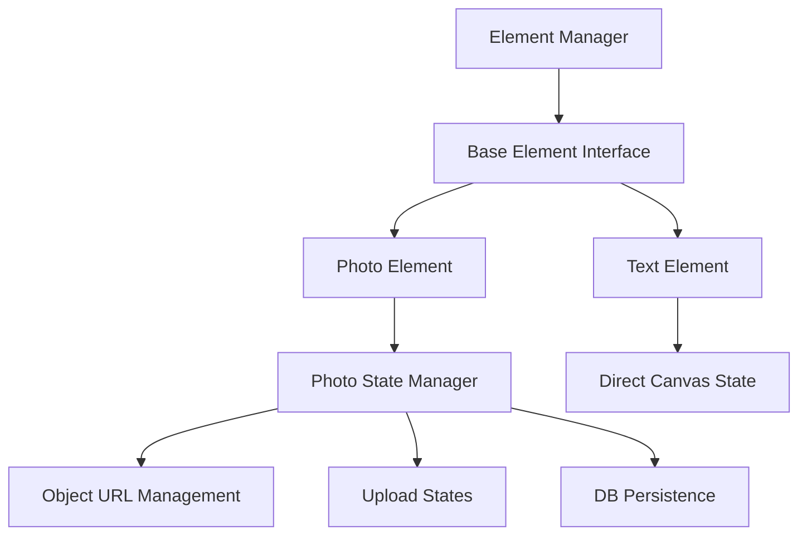

# Canvas Element Architecture Refactor

[Previous sections remain the same until Technical Considerations]

## Technical Considerations

### 1. Element-Specific State Management



#### A. Photo-Specific State

```javascript
// Photo states are managed separately due to their unique requirements
const photoStates = useRef({
  [id: string]: 'N' | 'P' | 'R'  // New, Persisted, Removed
});

const photoResources = useRef({
  [id: string]: {
    objectURL: string,
    // Any other photo-specific resources
  }
});
```

#### B. Generic Element Interface

```typescript
interface IBaseElement {
  id: string;
  type: ElementType;
  x: number;
  y: number;
  width: number;
  height: number;
  rotation: number;
}

// Photo extends base with special handling
interface IPhotoElement extends IBaseElement {
  type: "photo";
  image: HTMLImageElement;
  // Photo-specific properties
}

// Text is simpler - just canvas properties
interface ITextElement extends IBaseElement {
  type: "text";
  text: string;
  fontFamily: string;
  fontSize: number;
  // Text-specific styling
}
```

### 2. Element Manager Hook

```javascript
const useElementManager = () => {
  // Separate photo management
  const photoManager = usePhotoManager();

  // Generic element collections
  const [elements, setElements] = useState({
    photos: [], // Managed by photoManager
    texts: [], // Direct canvas elements
  });

  // Photo-specific operations
  const addPhoto = async (file) => {
    const photo = await photoManager.uploadAndProcess(file);
    setElements((prev) => ({
      ...prev,
      photos: [...prev.photos, photo],
    }));
  };

  const removePhoto = (id) => {
    photoManager.markForRemoval(id);
    setElements((prev) => ({
      ...prev,
      photos: prev.photos.filter((p) => p.id !== id),
    }));
  };

  // Generic element operations
  const addText = (textProps) => {
    const text = {
      id: `text-${Date.now()}`,
      type: "text",
      ...textProps,
    };
    setElements((prev) => ({
      ...prev,
      texts: [...prev.texts, text],
    }));
  };

  const removeText = (id) => {
    setElements((prev) => ({
      ...prev,
      texts: prev.texts.filter((t) => t.id !== id),
    }));
  };

  return {
    elements,
    photoManager,
    addPhoto,
    removePhoto,
    addText,
    removeText,
  };
};
```

### 3. Photo-Specific Manager

```javascript
const usePhotoManager = () => {
  // Photo state tracking
  const photoStates = useRef({});
  const photoResources = useRef({});

  const uploadAndProcess = async (file) => {
    // Handle upload, compression, etc.
    const photoData = await processPhotoUpload(file);
    photoStates.current[photoData.id] = "N";
    photoResources.current[photoData.id] = {
      objectURL: photoData.objectURL,
    };
    return photoData;
  };

  const markForRemoval = (id) => {
    photoStates.current[id] = "R";
    const objectURL = photoResources.current[id]?.objectURL;
    if (objectURL) URL.revokeObjectURL(objectURL);
  };

  const handleSaveSuccess = () => {
    // Update photo states post-save
    Object.keys(photoStates.current).forEach((id) => {
      if (photoStates.current[id] === "N") {
        photoStates.current[id] = "P";
      } else if (photoStates.current[id] === "R") {
        delete photoStates.current[id];
        delete photoResources.current[id];
      }
    });
  };

  return {
    photoStates,
    uploadAndProcess,
    markForRemoval,
    handleSaveSuccess,
  };
};
```

### 4. Save Process

```javascript
const handleSave = async () => {
  const updateData = {
    canvas: {
      photos: elements.photos.map((p) => ({
        id: p.id,
        x: p.x,
        y: p.y,
        width: p.width,
        height: p.height,
        rotation: p.rotation,
      })),
      texts: elements.texts, // Direct save - no special handling
      viewState: { scale, position },
    },
    // Only include photo states - texts don't need state tracking
    photoStates: photoManager.photoStates.current,
  };

  await memoryService.updateMemory(id, updateData);
  photoManager.handleSaveSuccess();
};
```

## Implementation Phases

### Phase 1: Photo Element Refactor

1. Create PhotoManager
2. Move photo-specific state handling
3. Update save/load process
4. Verify all photo operations work as before

### Phase 2: Text Integration

1. Implement basic text element support
2. Add text creation/editing
3. No need for state tracking - simpler implementation

[Rest of the document remains the same]
