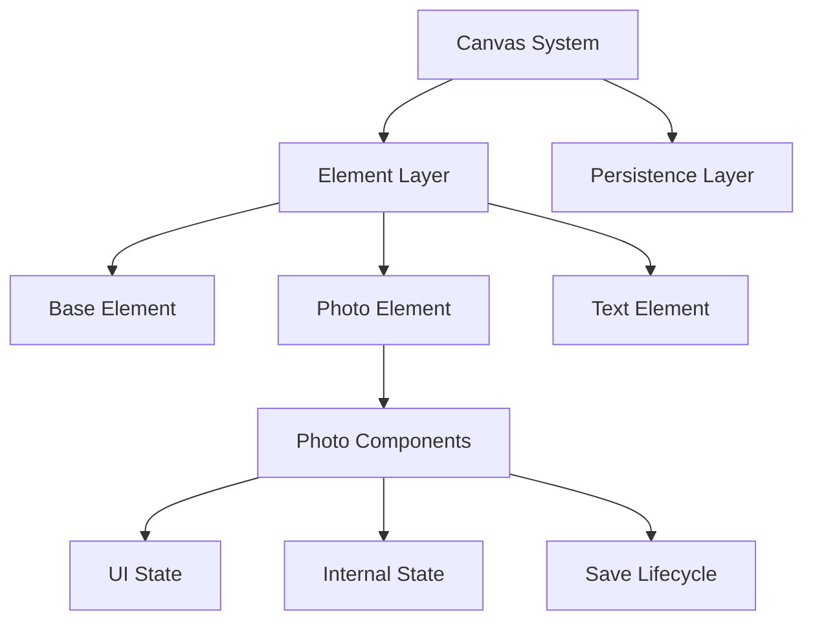

# Canvas Element Architecture Refactor

This document outlines a simplified architectural design for canvas elements that gracefully handles both generic and element-specific behaviors.

## System Overview



## 1. Core Architecture

### A. Base Element Interface

The foundation for all canvas elements, providing common behaviors and data structures:

```typescript
interface ICanvasElement {
  id: string;
  type: ElementType;

  // Generic transform properties (trigger re-render)
  transform: {
    position: Position;
    dimensions: Dimensions;
    rotation: number;
    zIndex: number;
  };

  // Common behaviors
  move(position: Position): void;
  rotate(angle: number): void;
  resize(dimensions: Dimensions): void;
  delete(): void;
  bringToFront(): void;
  sendToBack(): void;

  // Save lifecycle methods
  preSave(): void; // Prepare element for save
  postSave(): void; // Handle post-save state transitions
  getData(): unknown; // Get data needed for save
}
```

### B. Element Implementations

#### Photo Element

Handles photo-specific behaviors with clean state management:

```typescript
class PhotoElement implements ICanvasElement {
  // UI state that triggers re-renders
  private transform: Transform;

  // Internal states that don't trigger re-renders
  private stateRef: React.MutableRefObject<{
    state: "N" | "P" | "R"; // New, Persisted, Removed
    progress?: {
      phase: string;
      status: string;
      progress: number;
    };
  }>;

  constructor(id: string) {
    this.stateRef = useRef({
      state: "N",
      progress: undefined,
    });
  }

  // Handle photo upload with progress
  async handleUpload(file: File): Promise<void> {
    const updateProgress = (progress: ProgressUpdate) => {
      this.stateRef.current = {
        ...this.stateRef.current,
        progress: {
          phase: progress.phase,
          status: progress.status,
          progress: progress.progress,
        },
      };
      // Only trigger re-render for progress UI
      this.notifyProgressUpdate();
    };

    try {
      await memoryService.uploadPhoto(file, updateProgress);
      this.stateRef.current.progress = undefined;
    } catch (error) {
      this.stateRef.current = {
        ...this.stateRef.current,
        progress: {
          phase: "failed",
          status: error.message,
          progress: 100,
        },
      };
      this.notifyProgressUpdate();
      throw error;
    }
  }

  // Get data for save (only data that needs to be persisted)
  getData(): PhotoData {
    return {
      id: this.id,
      transform: this.transform, // UI state
      originalSize: this.originalSize, // Fixed data
      originalDimensions: this.originalDimensions,
      // Note: state not included here, managed separately
    };
  }

  // Pre-save handling
  preSave(): void {
    // No-op for photos, could be used for pre-save validation
  }

  // Post-save state transitions
  postSave(): void {
    const currentState = this.stateRef.current.state;
    if (currentState === "N") {
      this.stateRef.current.state = "P"; // New -> Persisted
    }
    // State changes in ref don't trigger re-render
  }

  // Get progress for UI if available
  getProgress(): ProgressState | undefined {
    return this.stateRef.current.progress;
  }
}
```

#### Text Element

Simple implementation with no special state management:

```typescript
class TextElement implements ICanvasElement {
  private transform: Transform;
  private textConfig: TextConfig;

  // Common behaviors
  move(position: Position): void {
    this.transform.position = position;
    this.notifyUpdate();
  }

  // Get data for persistence
  getData(): TextData {
    return {
      id: this.id,
      transform: this.transform,
      text: this.textConfig,
    };
  }

  // Default no-op save lifecycle implementations
  preSave(): void {}
  postSave(): void {}
}
```

## 2. Canvas Management

### A. Canvas Manager

Coordinates elements and handles persistence:

```typescript
class CanvasManager {
  private elements: Map<string, ICanvasElement>;

  async saveCanvas(): Promise<void> {
    // 1. Pre-save phase
    this.elements.forEach((element) => element.preSave());

    // 2. Collect and save data
    const saveData = {
      canvas: {
        viewState: this.stageState,
        elements: Array.from(this.elements.values()).map((e) => e.getData()),
      },
    };

    // 3. Atomic save
    await this.memoryService.updateMemory(this.canvasId, saveData);

    // 4. Post-save phase - each element handles its own state transitions
    this.elements.forEach((element) => element.postSave());
  }
}
```

## 3. Key Design Benefits

### A. Clean State Management

- UI state triggers re-renders when needed
- Internal state managed via refs to prevent unnecessary refreshes
- Clear separation between persisted data and internal state

### B. Element-Controlled Lifecycle

- Each element type handles its own save lifecycle
- Base interface provides default no-op implementations
- Canvas manager just orchestrates the process
- Easy to add pre/post save behaviors per element type

### C. Simplified Implementation

- Single interface for all elements
- Clear separation of concerns
- Predictable state transitions
- No accidental re-renders

### D. Maintainable Structure

- Easy to add new element types
- Consistent behavior patterns
- Clear data flow
- Efficient state updates

## 4. Future Considerations

### A. New Element Types

New elements can be added by implementing ICanvasElement:

- Pen tool implementation
- Sticker element implementation
- Shape elements
- Each can implement custom save lifecycle if needed

### B. Additional Features

The architecture supports easy addition of:

- Element grouping
- Layer management
- Undo/redo functionality
- Advanced transformations

### C. Performance Optimizations

Potential areas for optimization:

- Batch updates for multiple elements
- Lazy loading of resources
- Canvas rendering optimizations
- State transition optimizations
