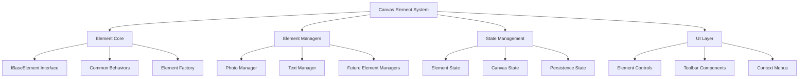

# Canvas Element Architecture Refactor

This document outlines the architectural design for refactoring the canvas elements system to support photos, textboxes, and future elements like pen tools and stickers.

## System Overview



## 1. Core Architecture Components

### A. Element Core System

The core system defines the base interfaces and common behaviors for all canvas elements.

```typescript
// Base interface for all canvas elements
interface IBaseElement {
  id: string;
  type: ElementType;
  position: Position;
  dimensions: Dimensions;
  transform: Transform;
  zIndex: number;

  // Common behaviors
  move(position: Position): void;
  resize(dimensions: Dimensions): void;
  rotate(angle: number): void;
  delete(): void;
}

// Factory for creating elements
class ElementFactory {
  createElement(type: ElementType, config: ElementConfig): IBaseElement;
}
```

### B. Element-Specific Implementations

Each element type has its own implementation with specialized behavior.

```typescript
// Photo element with special state handling
class PhotoElement implements IBaseElement {
  private state: PhotoState; // N, P, R states
  private resource: PhotoResource;

  // Photo-specific methods
  handleUpload(): Promise<void>;
  compress(): Promise<void>;
  persist(): Promise<void>;
}

// Text element implementation
class TextElement implements IBaseElement {
  private textConfig: TextConfig;

  // Text-specific methods
  updateText(text: string): void;
  updateFont(font: FontConfig): void;
}
```

### C. Element Managers

Managers handle element-specific operations and state management.

```typescript
// Base manager interface
interface IElementManager<T extends IBaseElement> {
  create(config: ElementConfig): T;
  update(element: T): void;
  delete(id: string): void;
  getState(): ElementState;
}

// Photo-specific manager
class PhotoManager implements IElementManager<PhotoElement> {
  private photoStates: Map<string, PhotoState>;
  private photoResources: Map<string, PhotoResource>;

  // Photo-specific operations
  handleUpload(file: File): Promise<PhotoElement>;
  handlePersistence(): Promise<void>;
}
```

### D. State Management System

Centralized state management for all canvas elements.

```typescript
// Central state management
class CanvasStateManager {
  private elements: Map<string, IBaseElement>;
  private elementManagers: Map<ElementType, IElementManager>;
  private canvasState: CanvasState;

  // State operations
  addElement(element: IBaseElement): void;
  updateElement(id: string, updates: Partial<IBaseElement>): void;
  deleteElement(id: string): void;

  // Layer management
  bringToFront(id: string): void;
  sendToBack(id: string): void;

  // Grouping operations
  groupElements(ids: string[]): void;
  ungroupElements(groupId: string): void;
}
```

## 2. Implementation Strategy

### Phase 1: Core Infrastructure

1. Set up the base element system

   - Implement IBaseElement interface
   - Create element factory
   - Set up basic state management

2. Create state management system
   - Implement central state manager
   - Set up element tracking
   - Add basic operations

### Phase 2: Photo Element Migration

1. Create PhotoManager

   - Implement photo state handling
   - Set up resource management
   - Migrate existing upload functionality

2. Migrate existing photo features
   - Move current photo logic to new system
   - Implement improved state handling
   - Ensure backwards compatibility

### Phase 3: Text Element Integration

1. Implement TextManager

   - Create text element class
   - Set up text-specific operations
   - Integrate with state management

2. Add text features
   - Migrate existing text functionality
   - Implement text editing
   - Add font management

### Phase 4: Common Features

1. Implement common behaviors

   - Drag and drop system
   - Rotation handlers
   - Resize functionality

2. Add layer management

   - Z-index handling
   - Bring to front/send to back
   - Layer ordering

3. Implement grouping
   - Group creation/deletion
   - Group transformations
   - Group state management

### Phase 5: Future Elements

1. Create plugin system

   - Define plugin interface
   - Add plugin registration
   - Create plugin loader

2. Add new element types
   - Implement pen tool
   - Add sticker support
   - Support future extensions

## 3. Benefits of This Architecture

### A. Separation of Concerns

- Each element type has its own dedicated manager
- State management is centralized but flexible
- UI components are decoupled from business logic
- Clear separation of responsibilities

### B. Extensibility

- New elements can be easily added by implementing IBaseElement
- Plugin system supports future feature additions
- Consistent behavior patterns across all elements
- Modular design for easy updates

### C. Performance

- Efficient photo state management
- Reduced unnecessary re-renders
- Optimized resource handling
- Smart caching of element states

### D. Maintainability

- Clear and consistent design patterns
- Type-safe implementations
- Well-defined interfaces
- Easy to test and debug

## 4. Future Considerations

### A. Additional Features

- Animation support
- Undo/redo system
- Advanced filter effects
- Custom element plugins

### B. Performance Optimizations

- Virtual scrolling for large canvases
- Lazy loading of resources
- WebWorker support for heavy operations
- Optimized rendering strategies

### C. Integration Points

- Export/import capabilities
- Version control support
- Collaborative editing
- Real-time synchronization

## 5. Technical Requirements

### A. Dependencies

- React for UI components
- Konva.js for canvas operations
- TypeScript for type safety
- State management library (if needed)

### B. Browser Support

- Modern browsers (latest 2 versions)
- Mobile browser compatibility
- Touch screen support
- Performance considerations for different devices

### C. Performance Targets

- Smooth operation with 50+ elements
- Quick response to user interactions
- Efficient memory usage
- Fast save/load operations
