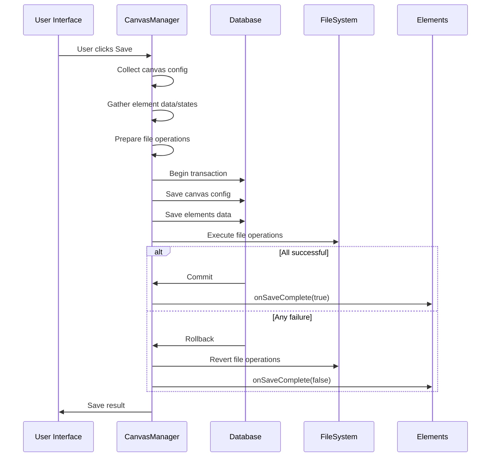

# Canvas Element Architecture Refactor

## State Management System

### Base Interface

```typescript
interface ICanvasElement {
  // Required by all elements
  id: string;
  type: string;
  getData(): unknown;

  // State management (optional)
  getPersistState?(): "N" | "P" | "R" | string;
  onSaveComplete?(success: boolean): Promise<void>;

  // File processing (optional)
  prepareSave?(): Promise<FileOperations>;
}
```

## Element Implementations

### Photo Element

```typescript
class PhotoElement implements ICanvasElement {
  // State transitions
  getPersistState() {
    return this.internalState;
  }

  async prepareSave() {
    if (this.internalState === "N") {
      return {
        moves: [{ from: this.tempPath, to: this.permPath }],
      };
    }
    return {};
  }

  async onSaveComplete(success) {
    if (success && this.internalState === "N") {
      this.internalState = "P";
    }
  }
}
```

### Text Element

```typescript
class TextElement implements ICanvasElement {
  // Stateless implementation
  getData() {
    return {
      text: this.content,
      position: this.position,
    };
  }
  // No state or file methods needed
}
```

## CanvasManager Save Implementation

```typescript
class CanvasManager {
  private canvasConfig: {
    pan: { x: number; y: number };
    zoom: number;
  };

  async saveCanvas() {
    // 1. Prepare all elements and collect data
    const elementsData = this.elements.map((e) => e.getData());
    const elementsStates = this.elements.map(
      (e) => e.getPersistState?.() || null
    );
    const fileOps = await Promise.all(
      this.elements.map((e) => e.prepareSave?.() || Promise.resolve({}))
    );

    // 2. Execute atomic transaction
    try {
      await memoryService.updateMemory({
        canvasConfig: this.canvasConfig,
        elements: elementsData,
        states: elementsStates,
        fileOperations: fileOps.flatMap((op) => op.moves || []),
      });

      // 3. Finalize successful save
      await Promise.all(this.elements.map((e) => e.onSaveComplete?.(true)));
    } catch (error) {
      // 4. Handle failure
      await Promise.all(this.elements.map((e) => e.onSaveComplete?.(false)));
      throw error;
    }
  }
}
```

## Transaction Flow



## State Transition Rules

| Element Type | States  | Transitions                    | DB Impact                  |
| ------------ | ------- | ------------------------------ | -------------------------- |
| Photo        | N, P, R | N→P (on save), P→R (on delete) | Creates/deletes records    |
| Text         | None    | No transitions                 | Updates canvas config only |
| Future Types | Custom  | Custom handlers                | Custom impact              |

## File Processing

```markdown
### For Elements Requiring File Operations:

1. Implement `prepareSave()` to declare needed file moves/deletes
2. File operations are executed atomically with DB changes
3. Cleanup happens in `onSaveComplete()`

### Handling Rules:

- Temp→Perm moves for new files (state=N)
- Perm file deletion only after DB commit (state=R)
- No file operations for stateless elements
```

## Implementation Guidelines

1. **For stateful elements**:

   - Implement all optional methods
   - Handle your specific state transitions
   - Manage file operations carefully

2. **For stateless elements**:

   - Only implement required methods
   - No need for state handling
   - Changes persist via canvas config

3. **Common Patterns**:

```typescript
// Typical stateful element pattern
class CustomElement implements ICanvasElement {
  // Required
  getData() {
    /* ... */
  }

  // Optional but recommended for stateful
  getPersistState() {
    /* ... */
  }
  prepareSave() {
    /* ... */
  }
  onSaveComplete() {
    /* ... */
  }
}
```
