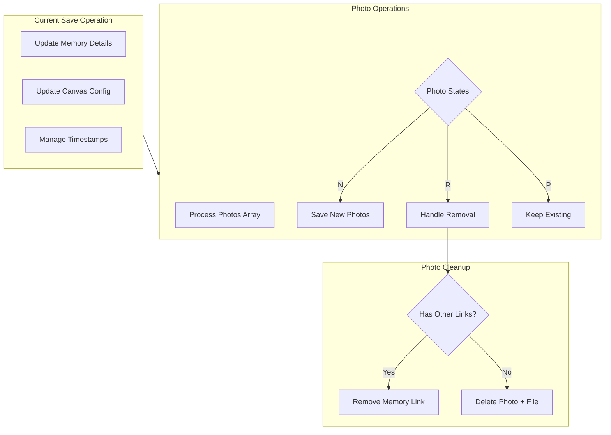

# Photo Implementation Plan

## Overview

This document outlines the implementation plan for the photo management system, focusing on state-based operations and proper cleanup processes.

## System Architecture



## What is expected:

Photo upload:
Frontend uploads photo and marks as "N" state
Photo is stored in temp directory
The photo showing is handle by photoRetrieveService that refer to temp location or permanent location based on state is N or P (this case is temp)
No DB record yet

Memory save:
Frontend preserves "N" state when sending to backend
Backend (in memory.js) now:
Creates photo record in DB
Links photo to memory
Moves file from temp to permanent storage
All in one transaction

After save:
Frontend reloads photos from backend
Photo state is P
The photo showing is handle by photoRetrieveService that refer to temp location or permanent location based on state is N or P (this case is permanent)
Shows photos with their correct states from backend

## Data Structures

### Memory Object with Photos

```javascript
{
    // Existing memory fields
    title: string,
    description: string,
    canvas: {
        // canvas configuration
    },

    // Added photo states
    photos: [
        { id: uuid, state: "N" },  // New photos to save
        { id: uuid, state: "P" },  // Existing photos to keep
        { id: uuid, state: "R" }   // Photos to remove
    ]
}
```

## API Endpoints

### 1. Photo Upload (New)

```
POST /api/photos/upload
Request: multipart/form-data
Response: { id: string }
```

### 2. Photo Retrieval (New)

```
GET /api/photos/retrieve/{id}?state=N|P
Response: photo binary data
Authorization: Based on state
```

### 3. Memory Save (Enhanced)

```
PUT /api/memories/:id
Request: {
    title: string,
    description: string,
    canvas: object,
    photos: [
        { id: string, state: "N"|"P"|"R" }
    ]
}
```

## Implementation Details

### Enhanced Save Operation

```javascript
async function saveMemory(memoryId, memoryData) {
  const client = await pool.connect();
  try {
    await client.query("BEGIN");

    // 1. Current Operations
    await client.query(
      "UPDATE memories SET title = $1, description = $2, updated_at = NOW() WHERE id = $3",
      [memoryData.title, memoryData.description, memoryId]
    );

    // 2. Update Canvas Configuration
    await client.query(
      "UPDATE memory_view_configurations SET config = $1 WHERE memory_id = $2",
      [memoryData.canvas, memoryId]
    );

    // 3. Process Photos Based on State
    const { photos } = memoryData;

    // Handle New Photos (N)
    const newPhotos = photos.filter((p) => p.state === "N");
    for (const photo of newPhotos) {
      await client.query(
        "INSERT INTO memory_photos (memory_id, photo_id) VALUES ($1, $2)",
        [memoryId, photo.id]
      );
    }

    // Handle Removed Photos (R)
    const removedPhotos = photos.filter((p) => p.state === "R");
    for (const photo of removedPhotos) {
      // First remove the memory-photo link
      await client.query(
        "DELETE FROM memory_photos WHERE memory_id = $1 AND photo_id = $2",
        [memoryId, photo.id]
      );

      // Check if photo has other canvas links
      const linksResult = await client.query(
        "SELECT COUNT(*) as link_count FROM memory_photos WHERE photo_id = $1",
        [photo.id]
      );

      // If no other links exist, delete the photo record and file
      if (linksResult.rows[0].link_count === 0) {
        // Get photo path before deletion
        const photoResult = await client.query(
          "SELECT file_path FROM photos WHERE id = $1",
          [photo.id]
        );

        // Delete photo record
        await client.query("DELETE FROM photos WHERE id = $1", [photo.id]);

        // Add to cleanup list for file removal after transaction
        const filePath = photoResult.rows[0].file_path;
        await cleanupQueue.push({ type: "delete", path: filePath });
      }
    }

    await client.query("COMMIT");

    // After successful transaction, process cleanup queue
    await processCleanupQueue();
  } catch (error) {
    await client.query("ROLLBACK");
    throw error;
  } finally {
    client.release();
  }
}
```

### Cleanup Process

```javascript
const cleanupQueue = [];

async function processCleanupQueue() {
  while (cleanupQueue.length > 0) {
    const task = cleanupQueue.shift();
    if (task.type === "delete") {
      try {
        await fs.remove(task.path);
      } catch (error) {
        console.error(`Failed to delete file: ${task.path}`, error);
        // Don't throw - file cleanup can be handled by maintenance job
      }
    }
  }
}
```

## Key Technical Points

### 1. Transaction Safety

- All database operations executed in a single transaction
- File cleanup operations performed only after successful transaction commit
- Proper rollback handling on failure

### 2. Photo Cleanup Process

- Check for other canvas links before deletion
- Remove photo record if no links exist
- Queue-based file deletion after transaction completion
- Resilient to file system errors

### 3. State-based Operations

- N (New): Link photos to memory
- R (Remove): Handle cleanup process
- P (Permanent): Maintain existing links

### 4. Error Handling

- Database transaction rollback on errors
- Separate file system error handling
- Non-blocking file cleanup process
- Error logging for maintenance follow-up
